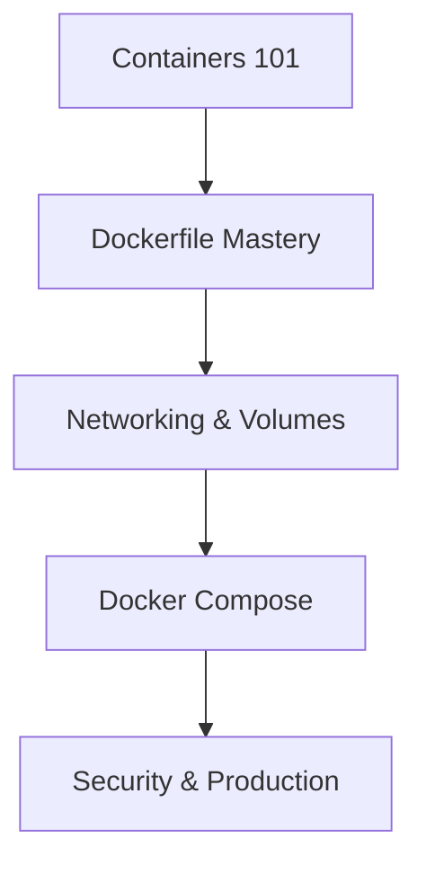

# Docker — Zero to Production

Welcome to the **Docker — Zero to Production** course. This comprehensive guide is designed to take you from container basics to production-grade orchestration and security.

---

## 🚀 Course Overview

Docker has revolutionized how we build, ship, and run applications. In this course, you will master:
*   **Container Fundamentals**: Understanding the Docker engine and architecture.
*   **Image Optimization**: Building tiny, secure, and fast-loading images.
*   **Service Orchestration**: Managing complex stacks with Docker Compose.
*   **Security & Hardening**: Protecting your containerized workloads.

---

## 🛤️ Learning Path

---

## 📚 Complete Syllabus

<a href="./01-containers" class="syllabus-item">
    
:material-cube-outline:

    

        01 — Containers 101
        Container vs VM, Docker architecture, and basic CLI commands.
    

</a>

<a href="02-dockerfile.md" class="syllabus-item">
    
:material-file-code:

    

        02 — Dockerfile Deep Dive
        Multi-stage builds, layer optimization, and best practices.
    

</a>

<a href="03-networking.md" class="syllabus-item">
    
:material-lan:

    

        03 — Networking & Volumes
        Managing persistent data and service communication.
    

</a>

<a href="04-compose.md" class="syllabus-item">
    
:material-layers-outline:

    

        04 — Docker Compose
        Orchestrating multi-service applications seamlessly.
    

</a>

<a href="05-registry.md" class="syllabus-item">
    
:material-shield-lock-outline:

    

        05 — Registry & Security
        Private registries, image signing, and vulnerability scanning.
    

</a>

<a href="06-production.md" class="syllabus-item">
    
:material-server-network:

    

        06 — Production Best Practices
        Health checks, resource limits, and logging.
    

</a>

---

## :material-youtube: YouTube Playlist

[:fontawesome-brands-youtube: Watch Full Playlist](https://youtube.com/@senvishal02){ .md-button .md-button--primary }

---

## :material-lightning-bolt: Quick Reference

[:material-lightning-bolt: Docker Cheatsheet](../../cheatsheets/docker.md){ .md-button }
[:material-help-circle: Docker Interview Q&A](../../interview-prep/devops/containers.md){ .md-button }
[:material-flask-outline: Docker Labs](../../labs/docker-labs/index.md){ .md-button }
