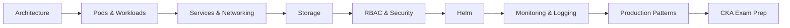

# :material-kubernetes: Kubernetes — Zero to CKA

⏱️ **~22 hours** &nbsp;·&nbsp; 📚 **9 modules** &nbsp;·&nbsp; 🔬 **8 labs** &nbsp;·&nbsp; 🎓 **Intermediate → CKA Ready**

!!! abstract "Course Overview"
    Kubernetes is the industry-standard container orchestration platform powering production
    workloads at scale. This course takes you from architecture understanding through hands-on
    cluster management to full CKA exam readiness.

---

## Learning Path

🟡 Intermediate → 🔴 Advanced → 🏆 CKA Ready

---

## Prerequisites

- [ ] Comfortable with Linux command line
- [ ] Basic Docker knowledge (images, containers, Compose)
- [ ] A running Kubernetes cluster (minikube, kind, or cloud)

---

## Complete Syllabus

### :material-numeric-1-circle: Phase 1 — Core Concepts

| Module | Topic | Level |
|--------|-------|-------|
| [01 — Architecture](01-architecture.md) | Control plane, kubelet, etcd, CNI | 🟡 Intermediate |
| [02 — Pods & Workloads](02-workloads.md) | Deployments, DaemonSets, StatefulSets, Jobs | 🟡 Intermediate |
| [03 — Services & Networking](03-networking.md) | ClusterIP, NodePort, Ingress, DNS | 🟡 Intermediate |

### :material-numeric-2-circle: Phase 2 — Storage, Security & Helm

| Module | Topic | Level |
|--------|-------|-------|
| [04 — Storage](04-storage.md) | PV, PVC, StorageClasses, CSI drivers | 🔴 Advanced |
| [05 — RBAC & Security](05-rbac.md) | Roles, ClusterRoles, PSP, NetworkPolicies | 🔴 Advanced |
| [06 — Helm](06-helm.md) | Chart authoring, templating, repositories | 🔴 Advanced |

### :material-numeric-3-circle: Phase 3 — Production & Exam

| Module | Topic | Level |
|--------|-------|-------|
| [07 — Monitoring & Logging](07-monitoring.md) | Prometheus, Grafana, Loki stack | 🔴 Advanced |
| [08 — Production Patterns](08-production.md) | HPA, VPA, PodDisruptionBudgets, drain/cordon | 🔴 Advanced |
| [09 — CKA Exam Prep](09-cka-prep.md) | Exam strategy, killer.sh walkthrough, time management | 🏆 CKA |

---

## Hands-On Labs

- [:material-flask-outline: Lab 01 — Deploy a Stateless App](../../labs/kubernetes-labs/lab-01-stateless-app.md)
- [:material-flask-outline: Lab 02 — PersistentVolumes & PVCs](../../labs/kubernetes-labs/lab-02-pv-pvc.md)
- [:material-flask-outline: Lab 03 — Ingress & TLS](../../labs/kubernetes-labs/lab-03-ingress.md)
- [:material-flask-outline: Lab 04 — RBAC Deep Dive](../../labs/kubernetes-labs/lab-04-rbac.md)
- [:material-flask-outline: Lab 05 — HPA & VPA](../../labs/kubernetes-labs/lab-05-autoscaling.md)
- [:material-flask-outline: Lab 06 — Network Policies](../../labs/kubernetes-labs/lab-06-network-policies.md)
- [:material-flask-outline: Lab 07 — Helm Chart Authoring](../../labs/kubernetes-labs/lab-07-helm.md)
- [:material-flask-outline: Lab 08 — Canary Deployments](../../labs/kubernetes-labs/lab-08-canary.md)

---

## Real-World Projects

- [:material-rocket-launch: EKS Production Cluster with Terraform](../../projects/devops-projects/eks-terraform.md)
- [:material-robot: GitOps with ArgoCD](../../projects/devops-projects/gitops-argocd.md)
- [:material-eye: Observability Stack (Prometheus + Grafana + Loki)](../../projects/devops-projects/observability.md)
- [:material-github: Self-hosted GitHub Runner on Kubernetes](../../projects/devops-projects/self-hosted-runner.md)

---

## Quick References

[:material-lightning-bolt: Kubernetes Cheatsheet](../../cheatsheets/kubernetes.md){ .md-button }
[:material-lightning-bolt: Helm Cheatsheet](../../cheatsheets/helm.md){ .md-button }
[:material-help-circle: Kubernetes Interview Q&A](../../interview-prep/devops/kubernetes.md){ .md-button }
[:material-map: DevOps Engineer Roadmap](../../roadmap/devops-roadmap.md){ .md-button }

---

## Interview Preparation

!!! tip "Key Topics for Kubernetes Interviews"
    - Explain the difference between a Deployment and a StatefulSet
    - How does Kubernetes handle service discovery?
    - What happens when a node goes down?
    - Describe the RBAC model — Role vs ClusterRole
    - How do you debug a CrashLoopBackOff pod?

[:material-help-circle: Full Kubernetes Interview Prep](../../interview-prep/devops/kubernetes.md){ .md-button .md-button--primary }

---

!!! success "Start Here"
    Begin with cluster architecture → [01 — Kubernetes Architecture](01-architecture.md)
