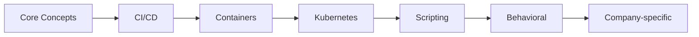

# :material-cog: DevOps Interview Preparation

> **Master the core topics tested in senior DevOps engineer interviews at FAANG, startups, and consulting firms.**

-   :material-counter: **80+ Questions**
-   :material-signal: **Mid → Staff Level**
-   :material-domain: **FAANG + Startups**
-   :material-clock-outline: **~40 Hours Study**

---

## :material-book-open: Modules

-   **Core Concepts** — DevOps principles, culture, toolchain philosophy, and infrastructure patterns
    [:octicons-arrow-right-24: Study](core-concepts.md)

-   **CI/CD Questions** — Pipeline design, deployment strategies, rollback patterns, and tool comparisons
    [:octicons-arrow-right-24: Study](cicd.md)

-   **Containerisation** — Docker internals, image optimisation, security scanning, and orchestration
    [:octicons-arrow-right-24: Study](containers.md)

-   **Kubernetes Q&A** — Architecture, workloads, networking, RBAC, troubleshooting, and CKA-level questions
    [:octicons-arrow-right-24: Study](kubernetes.md)

-   **Scripting & Automation** — Bash, Python, infrastructure automation, and tooling questions
    [:octicons-arrow-right-24: Study](scripting.md)

-   **Behavioral Questions** — Leadership, conflict resolution, incident handling, and STAR method preparation
    [:octicons-arrow-right-24: Study](behavioral.md)

-   **Company-wise (FAANG)** — Google, Amazon, Meta, Netflix, Apple — specific patterns and expectations
    [:octicons-arrow-right-24: Study](faang.md)

-   **Company-wise (Startups)** — Startup-specific DevOps expectations, breadth vs depth, and hands-on focus
    [:octicons-arrow-right-24: Study](startups.md)

---

## :material-map-marker-path: Study Order

!!! tip "Interview Day Checklist"
    - Review core concepts and CI/CD patterns
    - Practice explaining your most complex project
    - Prepare 3-4 STAR stories for behavioral rounds
    - Brush up on Kubernetes troubleshooting commands
    - Review the specific company's tech stack
