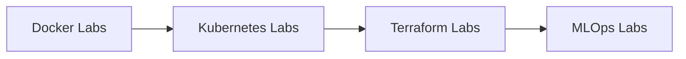

# :material-flask-outline: Hands-on Labs

> **Learn by doing — every lab runs in a real environment with step-by-step instructions, expected outputs, and troubleshooting guidance.**

Labs are designed to build muscle memory for production operations. Each lab includes prerequisites, architecture diagrams, complete instructions, and validation steps.

-   :material-counter: **22 Labs**
-   :material-signal: **Beginner → Advanced**
-   :material-clock-outline: **30–90 min each**
-   :material-update: **Production Patterns**

---

## :material-folder-open: Lab Categories

-   :material-kubernetes:{ .lg .middle } **Kubernetes Labs** · 8 Labs

    ---

    From deploying your first stateless app to production-grade canary deployments with network policies and autoscaling.

    **Difficulty:** Beginner → Advanced
    [:material-clock-outline: In Progress]{ .status-badge status-progress }

    [:octicons-arrow-right-24: Kubernetes Labs](kubernetes-labs/index.md)

-   :material-docker:{ .lg .middle } **Docker Labs** · 4 Labs

    ---

    Multi-stage builds, container networking deep dives, Compose stacks, and image security scanning with Trivy.

    **Difficulty:** Beginner → Intermediate
    [:material-pencil-outline: Planned]{ .status-badge status-planned }

    [:octicons-arrow-right-24: Docker Labs](docker-labs/index.md)

-   :material-terraform:{ .lg .middle } **Terraform Labs** · 5 Labs

    ---

    Provision real AWS infrastructure — VPCs, modules, remote state with S3/DynamoDB, Terragrunt, and drift detection.

    **Difficulty:** Intermediate → Advanced
    [:material-pencil-outline: Planned]{ .status-badge status-planned }

    [:octicons-arrow-right-24: Terraform Labs](terraform-labs/index.md)

-   :material-robot:{ .lg .middle } **MLOps Labs** · 5 Labs

    ---

    MLflow tracking server, Kubeflow pipelines, model serving with BentoML, feature stores with Feast, and LLM API deployment.

    **Difficulty:** Advanced
    [:material-pencil-outline: Planned]{ .status-badge status-planned }

    [:octicons-arrow-right-24: MLOps Labs](mlops-labs/index.md)

---

## :material-map-marker-path: Recommended Lab Path

---

## :material-format-list-checks: Lab Status Overview

| Lab Category | Count | Difficulty | Status |
|---|---|---|---|
| Kubernetes Labs | 8 | Beginner → Advanced | :material-clock-outline:{ style="color:#e5a50a" } In Progress |
| Docker Labs | 4 | Beginner → Intermediate | :material-pencil-outline:{ style="color:#94a3b8" } Planned |
| Terraform Labs | 5 | Intermediate → Advanced | :material-pencil-outline:{ style="color:#94a3b8" } Planned |
| MLOps Labs | 5 | Advanced | :material-pencil-outline:{ style="color:#94a3b8" } Planned |

!!! tip "Lab Environment"
    Most labs can be completed using local tools (Docker Desktop, Kind/Minikube, Terraform with LocalStack) or a free-tier cloud account. Each lab lists specific prerequisites.
