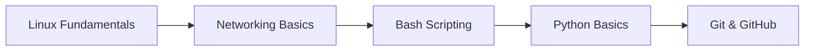

# DevOps Engineer Roadmap

> **Complete progression path for becoming a senior DevOps engineer.**

## Phase 1: Foundations (Months 1-3)

- :material-check-circle:{ style="color:#2bbc8a" } Linux CLI, file system, permissions, processes
- :material-check-circle:{ style="color:#2bbc8a" } TCP/IP, DNS, HTTP, firewalls
- :material-check-circle:{ style="color:#2bbc8a" } Bash scripting for automation
- :material-check-circle:{ style="color:#2bbc8a" } Python for infrastructure automation
- :material-check-circle:{ style="color:#2bbc8a" } Git workflows, branching strategies

## Phase 2: Containerisation & Orchestration (Months 4-6)

- :material-clock-outline:{ style="color:#e5a50a" } Docker — containers, images, Compose, security
- :material-clock-outline:{ style="color:#e5a50a" } Kubernetes — architecture, workloads, networking, RBAC
- :material-pencil-outline:{ style="color:#94a3b8" } Helm — package management
- :material-pencil-outline:{ style="color:#94a3b8" } Container security — scanning, signing, runtime

## Phase 3: CI/CD & Automation (Months 7-9)

- :material-pencil-outline:{ style="color:#94a3b8" } Jenkins / GitHub Actions
- :material-pencil-outline:{ style="color:#94a3b8" } Ansible — configuration management
- :material-pencil-outline:{ style="color:#94a3b8" } Terraform — Infrastructure as Code
- :material-pencil-outline:{ style="color:#94a3b8" } GitOps with ArgoCD

## Phase 4: Cloud & Production (Months 10-12)

- :material-pencil-outline:{ style="color:#94a3b8" } AWS / Azure — core services
- :material-pencil-outline:{ style="color:#94a3b8" } Monitoring — Prometheus, Grafana, Loki
- :material-pencil-outline:{ style="color:#94a3b8" } Security — DevSecOps, compliance
- :material-pencil-outline:{ style="color:#94a3b8" } Cost optimisation and FinOps

---

!!! success "Career Milestone"
    After completing this roadmap, you will have the skills for a **Senior DevOps Engineer** role at most organisations.
